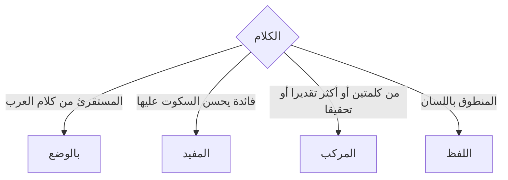
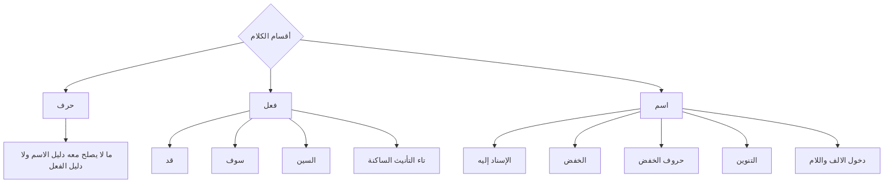
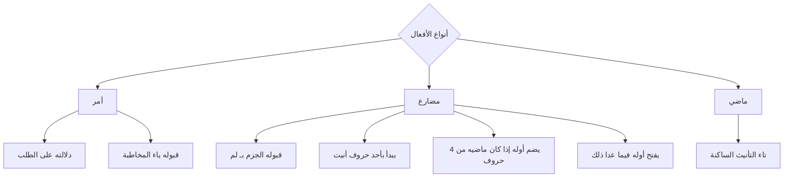

```mermaid
flowchart TD
 1{الكلام}
 1 -->|المستقرئ من كلام العرب| A[بالوضع]
 1 -->|فائدة يحسن السكوت عليها| B[المفيد]
 1 -->|من كلمتين أو أكثر تقديرا أو تحقيقا| C[المركب]
 1 -->|المنطوق باللسان| D[اللفظ]

```

```mermaid
flowchart TD
 1{أقسام الكلام}
 1 --> A[حرف]
 A --> A1[ما لا يصلح معه دليل الاسم ولا دليل الفعل]


 1 -->  B[فعل]

 B --> B2[قد]
 B --> B3[سوف]
 
 B --> B5[السين]
 B --> B6[تاء التأنيث الساكنة] 


 1 --> C[اسم]
 C --> C1[الإسناد إليه]
 C --> C2[الخفض]
 C --> C3[حروف الخفض]
 C --> C4[التنوين]
 C --> C5[دخول الالف واللام]
```

```mermaid
flowchart TD
 1{أنواع الأفعال}
 1 -->A[أمر]
 A --> A1[دلالته على الطلب]
 A --> A2[قبوله ياء المخاطبة]

 1 --> B[مضارع]
 B --> B1[قبوله الجزم بـ لم]
 B --> B2[يبدأ بأحد حروف أنيت]
 B --> B3[يضم أوله إذا كان ماضيه من 4 حروف]
 B --> B4[يفتح أوله فيما عدا ذلك]
 
 1 --> C[ماضي] --> C1[تاء التأنيث الساكنة] 

 
```

